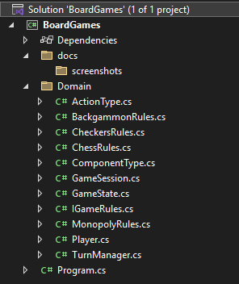
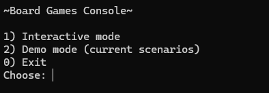
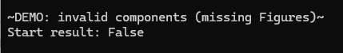
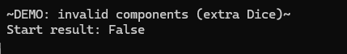
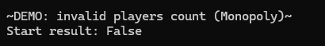
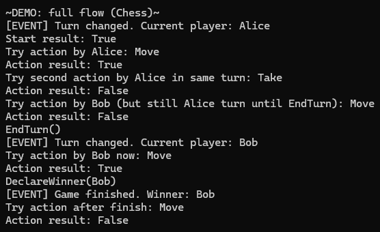

# APPZ Lab 1.2 — Variant 14 (Board Games)

## Overview
Console application (C#) that simulates playing board games according to **Variant 14**:
- **Monopoly**
- **Checkers**
- **Backgammon**
- **Chess**

Implemented requirements:
- Game starts only if the **required components** are present and **no extra** components exist.
- Game starts only if the **number of players** matches rules (e.g., Monopoly 2..6, others 2..2).
- Players act **in turns only** (strict order).
- **One action per turn**.
- Game ends when a **winner is declared**.
- Domain notifies UI via **events** (`TurnChanged`, `GameFinished`).

---

## Project structure
- `BoardGames/Domain/` — domain logic (entities, rules, session, turn manager)
- `BoardGames/Domain/Validation/` — setup validation (Chain of Responsibility)
- `BoardGames/Program.cs` — console UI (input/output, subscriptions to events)
- `BoardGames/docs/screenshots/` — screenshots

---

## How to run
1. Open the solution in **Visual Studio**.
2. Select the project as **Startup Project** (if needed).
3. Run:
   - **Ctrl + F5** (Run without debugging)  
   or  
   - **Start** button.

Interactive mode

## Flow:

Choose game rules (Chess / Checkers / Backgammon / Monopoly)
Enter player count and names (the domain validates rules on start)
Choose components “on the table”
Start the game (validation happens automatically)

### Commands

a — perform an action (only actions allowed by the selected game rules)
e — end turn (switch to the next player)
w — declare winner (finish game)
q — quit interactive session

### Events (UI output):

TurnChanged — prints the current player
GameFinished — prints the winner

## Demo mode

Start rejected due to missing required component (CoR → MissingComponentsValidator)
Start rejected due to extra component (CoR → ExtraComponentsValidator)
Start rejected due to invalid player count (CoR → PlayersCountValidator)
Full flow: turn order, one action per turn, declaring winner, events

## Design patterns used
### Strategy
Where: IGameRules + ChessRules / CheckersRules / BackgammonRules / MonopolyRules
Why: GameSession depends on abstraction (IGameRules) and switches behavior by injecting another rules implementation.
### Factory (Simple Factory)
Where: GameRulesFactory.Create(GameType)
Why: centralized creation of concrete IGameRules implementations; reduces coupling in Program.
### Chain of Responsibility (setup validation)
Where: SetupValidationChain + ISetupValidator + validators:
PlayersCountValidator
MissingComponentsValidator
ExtraComponentsValidator
Why: setup checks are split into single-responsibility validators; the chain returns the first failing OperationResult with a clear message.

## Screenshots
**01 — Visual Studio project opened**  

**02 — Program menu**  

**03 — Demo: invalid components (missing Figures)**  

**04 — Demo: invalid components (extra Dice)**  

**05 — Demo: invalid players count (Monopoly)**  

**06 — Demo: full flow (turn order + one action per turn + winner + events)**  

